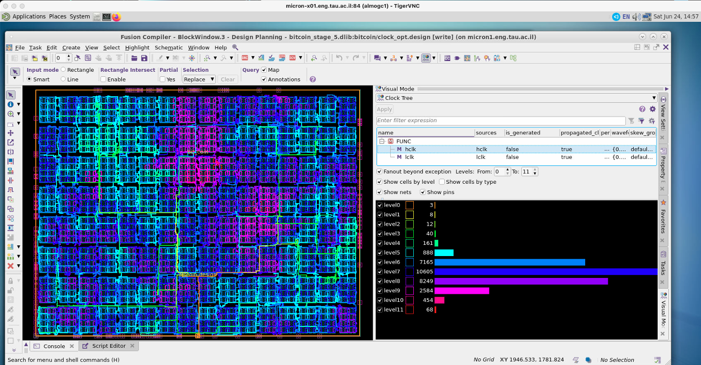

# Physical-Design-Flow-for-Bitcoin-Miner-based-ASIC-on-Synopsis-Fusion-Compiler

1) Implemented physical design stages for an ASIC having architecture derived from Bitcoin mining chip.
2) Implemented each stage by importing NDM libraries for the previous stage and running tcl scripts.
3) Design implemented using Synopsis SAED 32 nm technology.
4) Generated block diagrams and schematics after the design synthesis. Analyzed the timing reports and checked
for slack violations. Identified the critical paths and set up the false paths. Obtained static power = 110 mW and
dynamic power = 242 mW from the power report.
5) Conducted automatic and custom floorplanning. Did congestion analysis for each floorplan by observing the
total number of overflows in all the metal layers.
6) Generated post-placement timing reports and analyzed two paths with setup violations. Found negative slacks
of -0.05 ns and -0.23 ns for the paths and proposed solutions to solve the violations.
7) Generated clock tree distributions over the layout. lclk network is made up of 11 levels and has global skew of
0.33 ns, while the hclk has 13 levels and a global skew of 0.25 ns. Both the clocks operate at a frequency of 1 GHz.
8) After the routing stage, number of shorts = 20 and number of opens = 2.

I contributed by implementing Sythesis and Floorplan stage.

